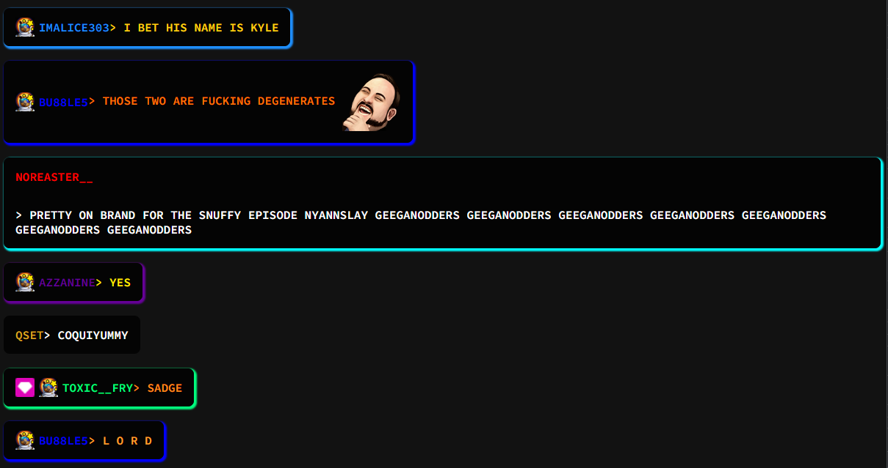

# HTML-Twitch-Chat-Overlay
A very crude demo on how to create a custom chat overlay for Twitch with only HTML, Javascript and CSS.

Todo:
* Implement queries for fetching the JSONs containing emote URL's. Probably not possible (at least easily) for Twitch cuz they need authentication for the APIs.

Easiest way to try this out:
1) Download VSCode
2) Install Live Server -extension for VSCode
3) Open the folder with VSCode and open up chat.html
4) CTRL + SHIFT + P -> Live Server

And now it should ask which browser you want to use, and the Live Server plugin will spin up a local server hosting the folder,
and a autorefreshing browser session.
