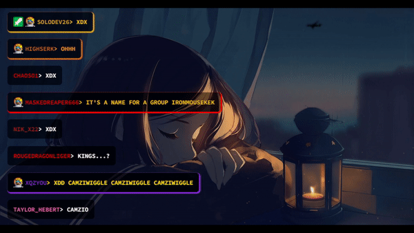

# HTML-Twitch-Chat-Overlay

NOTE: This project is a WIP and it is only for demonstrating purposes!

A very crude demo on how to create a custom chat overlay for Twitch with only HTML, Javascript and CSS. I have very little knowledge on web frontends and it definitely shows in the source code, but feel free to take a look if you are interested in implementing this yourself.


Main files:
* chat.html -> Contains all of the html + javascript
* twitch.css -> Style sheet

Todo:
* Implement queries for fetching the JSONs containing emote URL's. Probably not possible (at least easily) for Twitch cuz they need authentication for the APIs.

Easiest way to try this out:
Double click `chat.html`

How to get Twitch channel emotes:
1) [Get Twitch CLI](https://dev.twitch.tv/docs/cli/) (for windos scoop was pretty nice)
2) After getting the credentials, run
```twitch api get users -q login=channelNameHere```
3) Take the id from the previous request
4) Run ```twitch api get chat emotes -q broadcaster_id=idNumberGoesHere > temp.json```
5) For some reason, in windows the piped files are encoded in Windows-1252 and the files will not load as is. To fix this just open the ```temp.json``` and copy it to a new ```channelName.json``` file.

To debug/dev:
1) Download VSCode
2) Install Live Server -extension for VSCode
3) Open the folder with VSCode and open up chat.html
4) CTRL + SHIFT + P -> Live Server

And now it should ask which browser you want to use, and the Live Server plugin will spin up a local server hosting the folder,
and a autorefreshing browser session.
